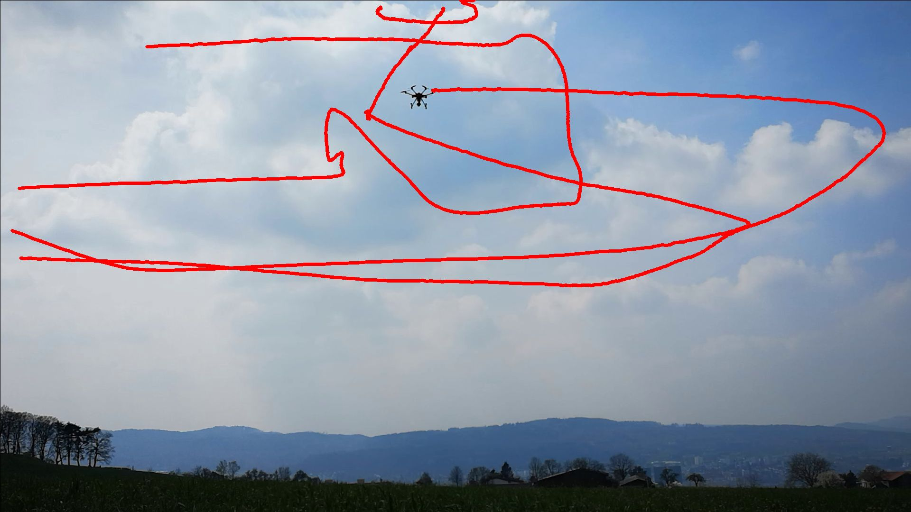

# drone-tracker
Technical challenge to track a single drone using visual-only sensor setup

# Notes

The report can be found in report.pdf and the code is in workspace.ipynb and utils.py
I have completed the 2d detection and tracking. Currently, still working on 3d.

# Dataset

This project uses the ETH Zurich Multi-View Drone Tracking datasets. 
git clone https://github.com/CenekAlbl/drone-tracking-datasets.git

As files are so large, need to use 7-zip archive manager to extract them: 
brew install p7zip

Then call the unpack script which loops through the zips and calls 7z
./unpack.sh

# Setup

Create conda environment:  
conda env create -f environment.yml 
conda activate drone-detect 

Install Ultralytics which contains the YOLO family:  
conda install -c conda-forge ultralytics

